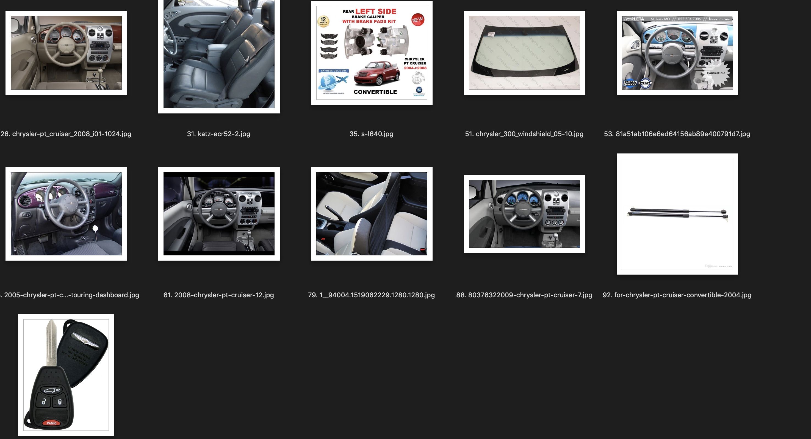
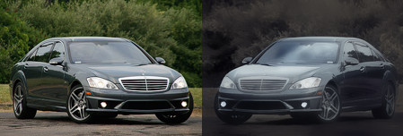
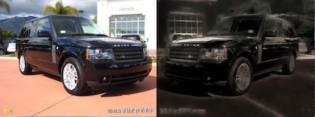

# GrabAIChallenge

This repository contains to run training and predictions for a modified Weakly Supervised Data Augmentation Network which achieves 96.18% validation accuracy: [See Better Before Looking Closer: Weakly Supervised Data Augmentation Network for Fine-Grained Visual Classification](https://arxiv.org/abs/1901.09891) using EfficientNet B3 as feature extractor [EfficientNet: Rethinking Model Scaling for Convolutional Neural Networks](https://arxiv.org/abs/1905.11946) 

I also explored using Segmentation and Style Transfer GAN augment images from day time to night time. For more information on code usage, please skip over to Usage section.


## Data Preparation

I used the stanford cars dataset sorted by classes folder at [https://www.kaggle.com/jutrera/stanford-car-dataset-by-classes-folder](https://www.kaggle.com/jutrera/stanford-car-dataset-by-classes-folder)

First I combined the provided train and test dataset and did a 75/25 train test split using rebuild_dataset.py to maximise the training data available

Train size: 12208    Test size: 3997

Duplicates have been removed using Gemini.

I added new data from Google Images using the script g_images_download.py

Some of these new images are irrelevant (car interiors or car parts). I cleaned around 25 image folders manually and fine-tuned a pretrained Xception to classify these new images as wanted or unwanted. We used this model to help us clean the rest of the data using predict_unwanted_images.py. This dataset is combined with the original 12208 training images and I will refer to it as 'New Data'. Some of the images classified as unwanted by this model are shown below:



The new data is also cleaned manually as there are some images misclassified by Google Images eg: convertible vs coupe, Dodge Challenger vs Dodge Charger SRT. I will refer to this dataset as 'New Data V2'.

## Model

I first used a standard image classification method to obtain a baseline. I used Xception with [random erasing augmentation](https://github.com/yu4u/cutout-random-erasing), [AdaBound optimizer](https://github.com/titu1994/keras-adabound) and class weights. Adding new data seems to reduce validation accuracy as some of the images from Google Images come with advertisement words and graphics that may have confused the classifier (advertisment graphics for cheaper cars differ significantly compared to those for more expensive cars)

#### CNN Baseline Results

| Model Name                                                 | Training Accuracy | Validation Accuracy |
| ---------------------------------------------------------- | ----------------- | ------------------- |
| CNN Baseline: Xception, random cutout, adabound optimiser  | 98.11             | 93.66               |
| CNN Baseline New Data Classweights                         | 95.38             | 92.27               |
| CNN Baseline New Data V2 Classweights                      | 97.25             | 93.51               |
| CNN Baseline New Data V2 Classweights Increased Image Size | 98.36             | 93.30               |


I used the implementation of Weakly Supervised Data Augmentation (WSDAN) from [https://github.com/GuYuc/WS-DAN.PyTorch](https://github.com/GuYuc/WS-DAN.PyTorch). However, the original implementation seems to have performance issues as some users have [commented](https://github.com/GuYuc/WS-DAN.PyTorch/issues/1). Running the original implementation on my rebuilt dataset, I only managed to obtain 91.28% accuracy.


After reading through the paper and code in depth, I realised there were a few implementation errors. After fixing the errors, I managed to obtain 95.31% validation accuracy which is further increased to 95.97% using additional data from Google Images. Since the network uses attention cropping, the effect of advertisement words and graphics seems to be mitigated.  Switching the feature extractor to EfficientNetB3 from InceptionV3 and increasing the number of attention maps from 32 to 64 resulted in the final validation accuracy of 96.18%.

#### WS DAN Results

| Model Name                                                                    | Training Accuracy | Validation Accuracy |
| ----------------------------------------------------------------------------- | ----------------- | ------------------- |
| Original Implementation                                                       | 99.76             | 91.28               |
| Change (256, 256) crop size to original image size                            | 99.76             | 93.29               |
| Change LR schedule to reduce on plateau and remove double input preprocessing | 99.84             | 95.31               |
| New Data V2                                                                   | 99.95             | 95.97               |
| EfficientNetB3                                                                | 99.95             | 95.99               |
| **EfficientNetB3, 64 attention maps (epoch 34)**                              | **99.95**         | **96.18**           |
| EfficientNetB4, 64 attention maps                                             | 99.89             | 94.23               |


## Style Transfer GAN

As the training dataset consists of only day time images, I explored using [Unsupervised Image-to-Image Translation](https://github.com/mingyuliutw/UNIT) (UNIT) and [Fast Photo Style Transfer](https://github.com/NVIDIA/FastPhotoStyle) to convert day time images to night time. I tried collecting night time images from Google Images, but there are only a few relevant images per car brand so I went out to film some of my own night time data. In total we had only 366 night time images however and the results should be better should more data be available. For Fast Photo Style Transfer we first used [DeepLabV3 with Xception Backbone](https://github.com/tensorflow/models/tree/master/research/deeplab) to obtain segmentation maps as the results without segmentation maps are quite bad. As the code is licensed under a non-commercial license, I won't be able to include it here.

Here are some of the results from UNIT:


Here are some of the results from FastPhotoStyle using segmentation maps:






## Usage

### Requirements

Python 3.6

```
scikit-learn~=0.20.3 numpy~=1.15.4 pandas~=0.24.2 tqdm~=4.31.1
```


For CNN Baseline:

I used the tensorflow_p36 environment on AWS Linux

```
keras==2.2.4 keras-applications==1.0.7 keras-metrics==1.1.0 keras-preprocessing==1.0.9 tensorflow==1.13.1
```


For WS DAN

I used the pytorch_p36 environment on AWS Linux

```
pytorch==1.1.0 torchvision==0.2.2
```

EfficientNet needs to be installed by running

```bash
cd EfficientNet-PyTorch
python setup.py develop --no-deps
```

### Run Predictions

```
cd ws-dan
python wsdan_predict.py --data-dir path_to_images --ckpt-dir path_to_model_checkpoint --output-dir path_to_save_predictions
```

The best performing model EfficientNetB3 with 64 attention maps can be downloaded here: https://drive.google.com/file/d/1fT20Xom6x_TDSCHsyh8pDYfHp4-6LjaO/view?usp=sharing

Options:

  -j , --workers
                            number of data loading workers (default: n_cpus)

  -b , --batch-size
                            batch size (default: 32)

  --fn, --feature-net
                            Name of base model. Accepted values are
                        inception/ resnet152cbam/ efficientnetb3

  --gpu, --gpu-ids
                            IDs of gpu(s) to use in inference, multiple gpus
                        should be seperated with commas (default: 0)

  --de, --do-eval
                            If labels are provided, set True to evaluate metrics
                        (default: True)

  --csv, --csv-labels-path
                            If eval mode is set, set to "folder" to read labels
                        from folders with classnames. Set to csv path to read labels from csv (default: folder)

  --csv-headings
                            heading of image filepath and label columns in csv

  --dd, --data-dir
                            directory to images to run evaluation/ prediction

  --cp, --ckpt-path
                            Path to saved model checkpoint (default:
                        ./checkpoints/model.pth)

  --od, --output-dir
                            saving directory of extracted class probabilities csv
                        file


### Run Training

```
cd ws-dan
python train_wsdan.py 
```

Options:
  -j , --workers
                            number of data loading workers (default: 16)

  --gpu, --gpu-ids
                            IDs of gpu(s) to use in inference, multiple gpus
                        should be seperated with commas

  -v, --verbose
                            show information for each <verbose> iterations
                        (default: 0)

  -b, --batch-size
                            batch size (default: 32)

  -e, --epochs
                            number of epochs (default: 100)

  --lr, --learning-rate
                            learning rate (default: 0.001)

  -m, --model
                            model for feature extractor
                        (inception/resnetcbam/efficientnetb3/efficientnetb4

  -c, --ckpt      path to checkpoint directory if resuming training
                        (default: False)

  --dd, --data-dir
                            path to directory containing folders named 'train' and 'test'

  --sd, --save-dir
                            saving directory of .ckpt models (default:
                        ./checkpoints/model)

  --sf, --save-freq
                            saving frequency of .ckpt models (default: 1)
